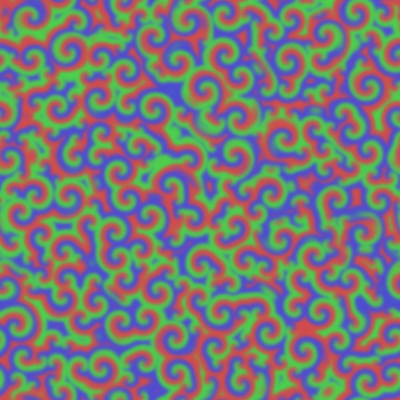
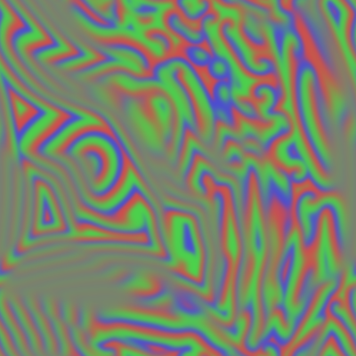
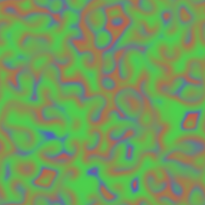

# bz
Simple Belousov-Zhabotinsky(BZ) reaction simulator on p5.js.

## Demo
OpenProcessing

https://www.openprocessing.org/sketch/555612

## Screenshots
   

## Comments
GPU is not used for calculations, so the framerate may be low.
